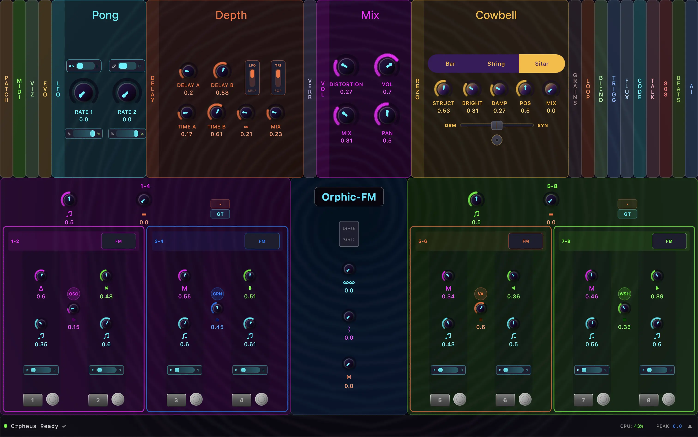
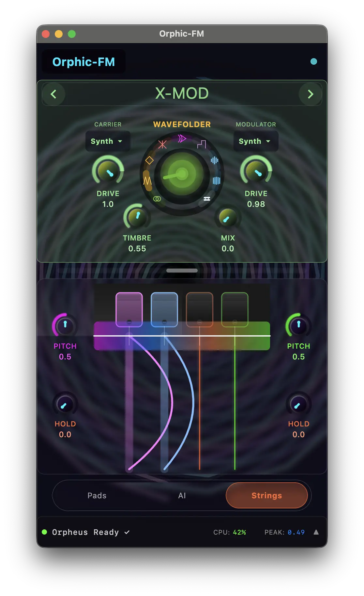
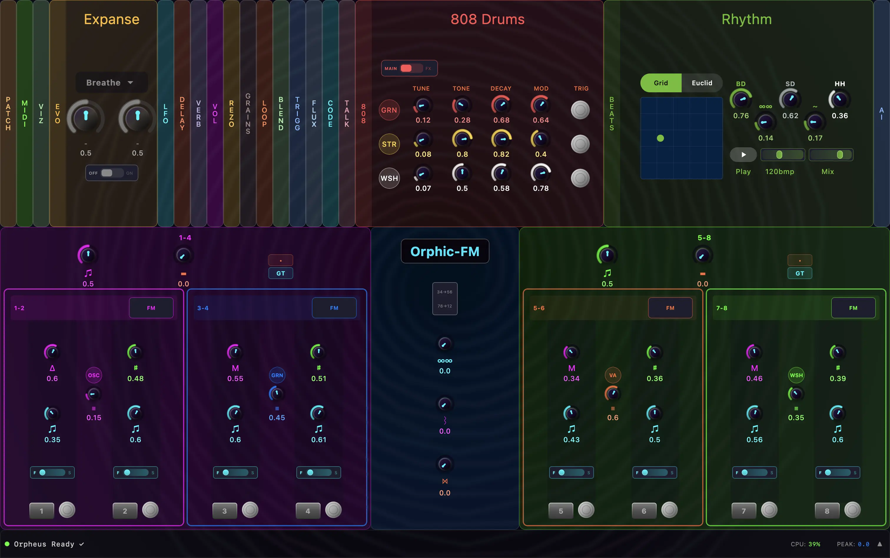
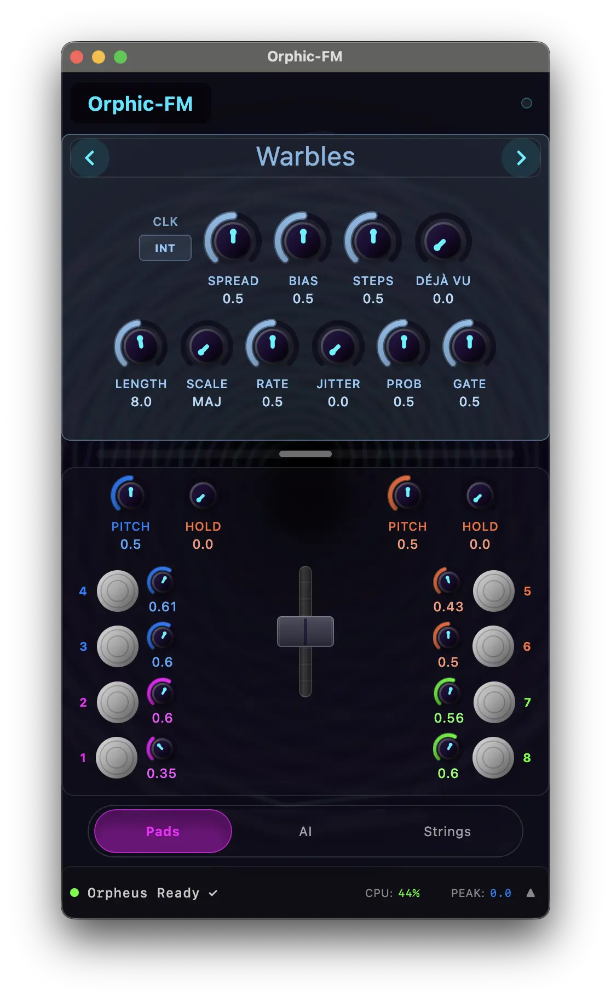

> Orpheus (from Ancient Greek: Ὀρφεύς) was a divine musician from Greek Mythology who used his music to charm Hades and Persephone so he could rescue his wife, Eurydice from the Underworld. He was a master of the Lyre.

> FM stands for Frequency Modulation which describes a technique to enhance sound by creating rich harmonics involving changing the pitch of waveforms produced by Oscillators.

# Orphic-FM
An 8-oscillator organismic synthesizer built with Kotlin Multiplatform, targeting Desktop and Android.

## Overview
Orphic-FM is an 8-oscillator Synthesizer Emulator combining sounds and harmonics with semi-random math and AI. Oscillators are hierarchically grouped and cross-modulated until the sound takes on a life of its own. Eight voices pair into four duos, which group into two quads, with modulation layered at every level. Add a dual delay system that can self-oscillate, a plate reverb, stereo distortion, add in AI agent control and things get interesting fast.

This instrument is inspired by the [Lyra-8 Orgasmic Synthesizer](https://somasynths.com/lyra-organismic-synthesizer/) and adds 17 additional synthesis engines ported from the awesome OSS [Mutable Instruments' Eurorack firmware](https://github.com/pichenettes/eurorack) -- FM, virtual analog, granular, physical modeling strings, modal resonators, additive, waveshaping, speech synthesis, and four drum voices.

Under the hood [JSyn](http://www.softsynth.com/jsyn/) does the heavy audio lifting by providing a high-performance audio engine for real-time audio synthesis, wrapped in a Java API which works well from a Kotlin Multiplatform JVM perspective. I mainly run the app on desktop for it's speed and CPU capabilities, but I also needed an Android Mobile version to play around with on my phone. 

I had multiple motivations for building this project, but I mainly did it because I've always wanted to build some kind of instrument, and now AI agents make that possible. AI played a big part in the development and it will be interesting to see what happens as Orpheus learns to master the synth. 

Check out **[orphic.fm](https://orphic.fm/)** for music generated by Orpheus

## Screenshots
|                       Desktop                       |                       Android                       |
|:---------------------------------------------------:|:---------------------------------------------------:|
|  |  |
|  |  |

## Synthesis

- **8 Organismic Voices** with non-linear envelopes, cross-FM, per-voice stereo panning, and hierarchical duo/quad grouping
- **17 Plaits Engines** ported from Mutable Instruments: FM, Virtual Analog, Additive, Waveshaping, Noise, Granular, String (Karplus-Strong), Modal Resonator, Speech (formant/LPC/SAM), Particle, Swarm, Chord, Wavetable
- **4 Drum Engines** -- Analog Bass Drum, Analog Snare, Metallic Hi-Hat, FM Drum -- each assignable to independent slots with a beat sequencer
- **FM Self-Feedback** on the default oscillator, harmonics control across all engine types

## Effects

- **Hyper LFO** -- two oscillators with AND/OR/FM combining for complex modulation shapes
- **Dual Modulating Delays** with self-modulation, LFO routing, and feedback loops capable of self-oscillation
- **Dattorro Plate Reverb** ported from Mutable Instruments Rings
- **Stereo Distortion** -- parallel clean/drive paths with TanhLimiter soft-clipping
- **Resonator** filter bank and **Warps** phase modulation

## Performance & Control

- **Full MIDI** with learn mode and arbitrary controller mapping
- **Tidal Cycles** live-coding integration
- **Preset System** for saving and recalling patches
- **Evolutionary Parameter Search** -- algorithmic exploration of the parameter space
- **Platform TTS** -- macOS `say` and Android native speech routed through the effects chain

## AI Agent

An in-app chat agent (built on [Koog](https://github.com/koog-ai/koog-agents) with Gemini) can control the synth through natural language. It has tool access to set any parameter, trigger voices, switch engines, and speak words through the vocoder. The agent observes synth state changes in real time and can reason about the current sound.

## How It's Built

### Module Layout
```
core/audio/          DSP engine interfaces, plugin system, type-safe port DSL
core/foundation/     MIDI, presets, SynthController event bus, speech
core/plugin-api/     Shared symbol definitions across all plugins
core/plugins/        14 self-contained DSP plugin modules
features/            20+ UI feature modules (Compose + ViewModel, MVI)
ui/theme, ui/widgets Dark synth theme, knobs, sliders, collapsible panels
apps/composeApp/     App wiring: signal routing, voice management, DI
build-logic/         Convention plugins for consistent KMP module config
```

### Signal Path
```
8 Voices -> Per-Voice Stereo Pan -> Dry Bus
  -> Parallel Clean / Distortion
    -> Dual Modulating Delays (LFO + Feedback)  \
    -> Dattorro Plate Reverb (parallel send)      |-> Stereo Sum -> Master Out
```

### Plugin Architecture

Every DSP module implements `DspPlugin` and declares its ports through a type-safe Kotlin DSL. Plugins register via [Metro](https://github.com/ZacSweers/metro) DI with `@ContributesIntoSet` and are discovered at compile time -- no runtime reflection, no service loaders.

### Event Routing

`SynthController` is the central bus. Every control event carries an `origin` (`MIDI`, `UI`, `SEQUENCER`, `TIDAL`, `AI`, `EVO`) so the system knows who's driving a parameter and avoids conflicts. ViewModels observe `StateFlow` and update UI state based on events that happen throughout the system.

### Platforms

| Platform | Audio | Status |
|----------|-------|--------|
| Desktop (JVM) | JSyn | Primary target |
| Android | JSyn | Full support |
| wasmJs | Stub | UI only |
| iOS | -- | Skeleton |

## Build & Run

### Configuration

**AI API Keys (optional):** The AI agent feature requires API keys. Create or edit `local.properties` in the project root and add:

```properties
# Gemini API Key - https://ai.google.dev/
GEMINI_API_KEY=your_gemini_api_key_here

# Anthropic API Key - https://console.anthropic.com/
ANTHROPIC_API_KEY=your_anthropic_api_key_here
```

> `local.properties` is gitignored and will not be committed. The keys are injected at build time via [BuildKonfig](https://github.com/nichenqin/buildkonfig). The app builds and runs without them allowing the user to add their own AI API key at runtime. 

### Commands

```bash
# Desktop
./gradlew :apps:composeApp:run

# Android
./gradlew :apps:composeApp:installDebug

# Release (dmg/msi/deb depending on OS)
./gradlew :apps:composeApp:packageReleaseDistributionForCurrentOS

# Full build
./gradlew build
```

## Dependencies

| Dependency | Description |
|---|---|
| [Kotlin](https://kotlinlang.org/) | Language and multiplatform framework (2.3.0) |
| [Compose Multiplatform](https://www.jetbrains.com/lp/compose-multiplatform/) | Cross-platform UI for Desktop, Android, and Web |
| [Material3](https://developer.android.com/jetpack/compose/designsystems/material3) | Material Design 3 components and adaptive layouts |
| [Liquid](https://github.com/FletchMcKee/liquid) | Glassmorphism blur effects for Compose |
| [Metro](https://github.com/ZacSweers/metro) | Compile-time dependency injection for Kotlin by Zac Sweers |
| [JSyn](http://www.softsynth.com/jsyn/) | Real-time audio synthesis library by Phil Burk |
| [ktmidi](https://github.com/atsushieno/ktmidi) | Kotlin Multiplatform MIDI I/O |
| [CoreMIDI4J](https://github.com/DerekCook/CoreMidi4J) | macOS CoreMIDI access for JVM |
| [Mutable Instruments Eurorack](https://github.com/pichenettes/eurorack) | Emilie Gillet's open-source module firmware -- Plaits engines, Rings reverb, and drum synthesis ported to Kotlin |
| [Koog](https://github.com/JetBrains/koog) | AI agent framework with Gemini integration |
| [Ktor](https://ktor.io/) | Kotlin async HTTP client |
| [KmLogging](https://github.com/DiamondEdge1/KmLogging) | Kotlin Multiplatform structured logging|
| [Markdown Renderer](https://github.com/mikepenz/multiplatform-markdown-renderer) | Multiplatform Markdown rendering for Compose by Mike Penz |
| [BuildKonfig](https://plugins.gradle.org/plugin/com.codingfeline.buildkonfig) | Cross-platform BuildConfig for KMP |
| [Logback](https://logback.qos.ch/) | JVM logging framework |

---

**License:** [GNU GPLv3](LICENSE)
