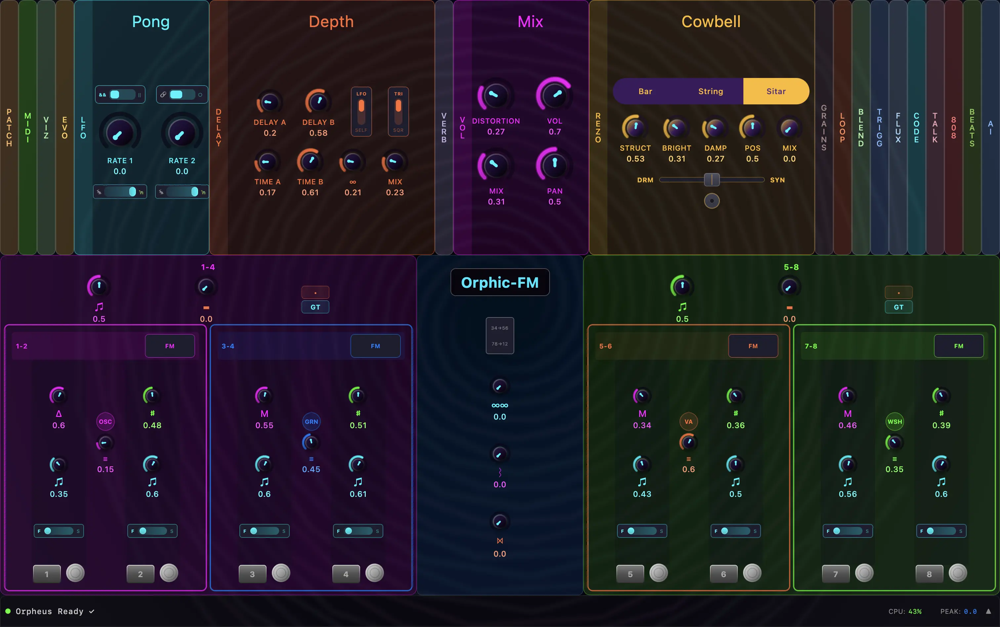
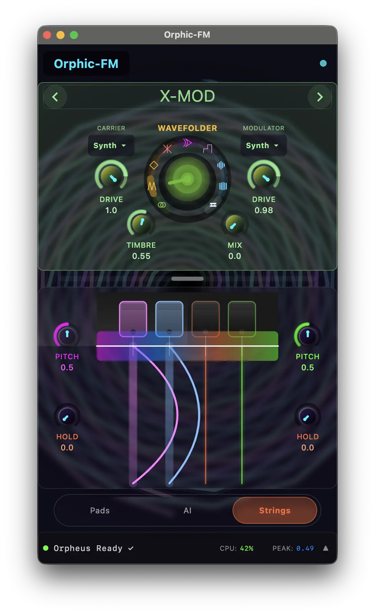
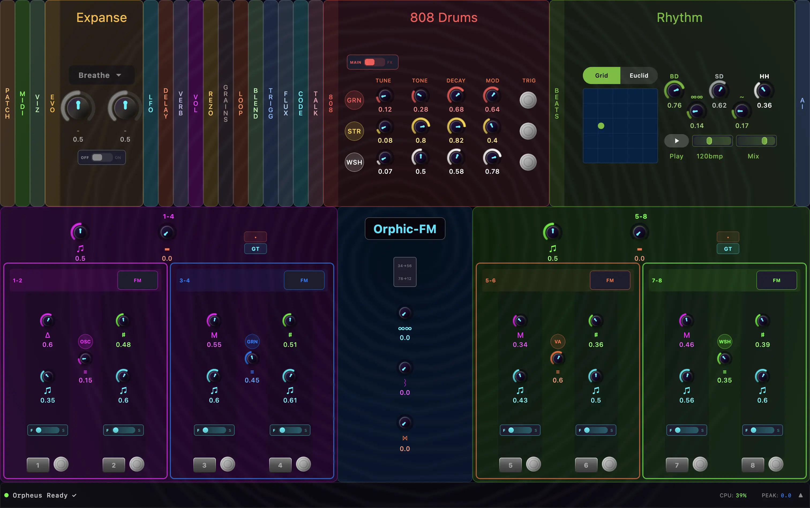
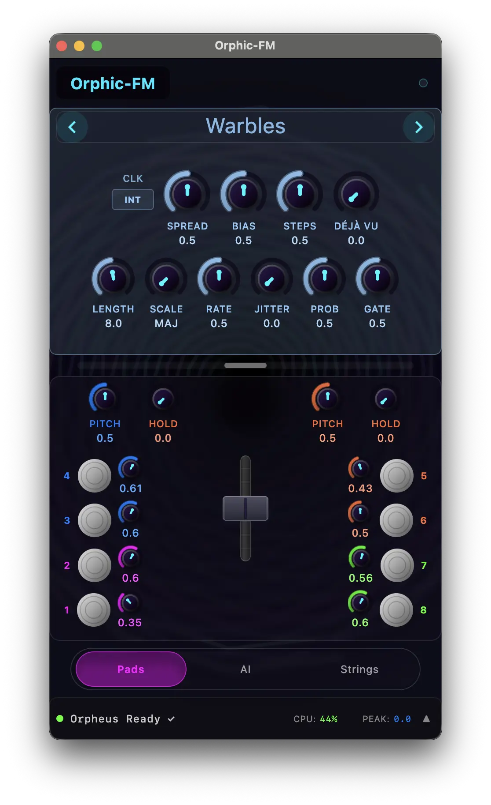
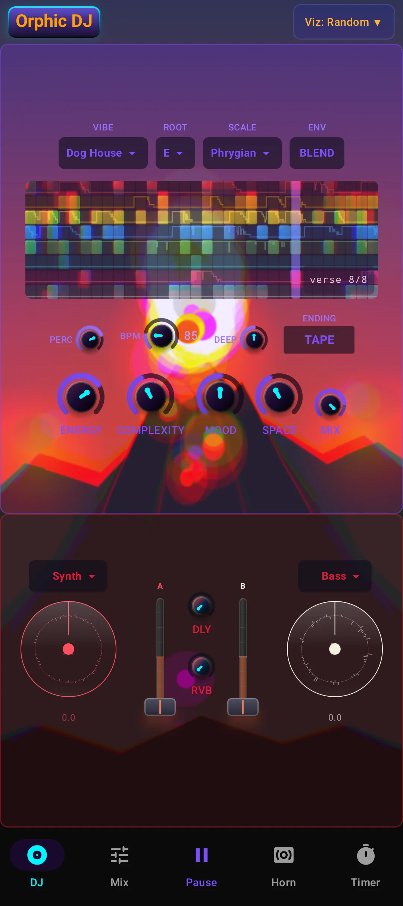
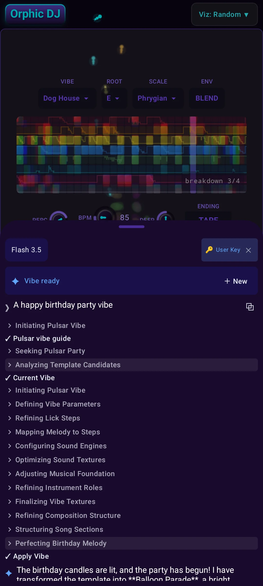
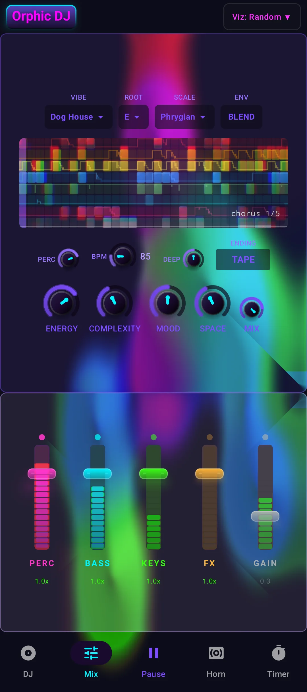
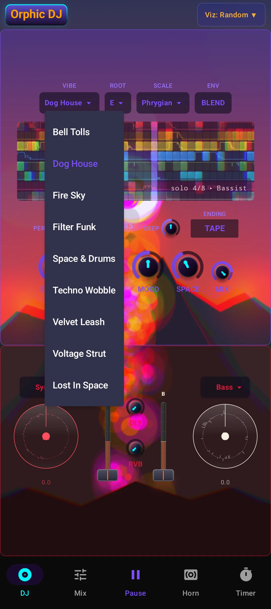
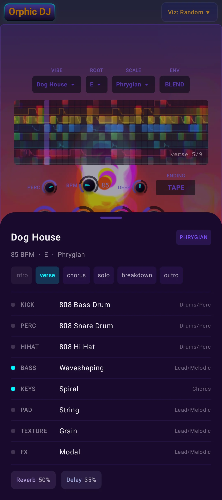

# Orphic FM

> Orpheus (Ancient Greek: Ὀρφεύς) was the divine musician of Greek myth. He charmed Hades and Persephone with his lyre to win Eurydice back from the Underworld.

> FM is Frequency Modulation, a synthesis technique that builds rich harmonics by letting one oscillator bend the pitch of another.

**Orphic-FM** is a 12-voice synthesizer with many features allowing the creation of all types of soundscapes. **Orphic DJ** combines a few of those features to provide an Interactive Album Experience allowing the user to modify and enhance pre-defined "Vibes". Both are Kotlin Multiplatform apps rendering through the same shared C++ DSP engine (`liborpheus_dsp/`).

These apps were inspired by various Eurorack modules and electronic instruments. This project allows me to express my sonic, visual, and AI prompting creativity. Check out **[orphic.fm](https://orphic.fm/)** for music generated by Orpheus.

## Orphic-FM - 12-voice synthesizer

|                       Desktop                       |                       Android                       |
|:---------------------------------------------------:|:---------------------------------------------------:|
|  |  |
|  |  |

Orphic-FM combines sounds and harmonics with semi-random math and AI. Twelve voices pair into six duos, which group into three quads, and modulation layers at every level until the sound takes on a life of its own. It is inspired by the [Lyra-8 Organismic Synthesizer](https://somasynths.com/lyra-organismic-synthesizer/) and extends it with synthesis engines ported from the open-source [Mutable Instruments Eurorack firmware](https://github.com/pichenettes/eurorack): FM, virtual analog, granular, physical modeling strings, modal resonators, additive, waveshaping, speech, and four drum voices.

- **12 voices** with non-linear envelopes, cross-FM, per-voice stereo panning, duo/quad grouping
- **Plaits engines** ported from Mutable Instruments, plus 4 drum engines with a beat sequencer
- **Dual modulating delays** that can self-oscillate, Dattorro plate reverb, stereo distortion
- **Duo LFO**, resonator filter bank, Warps phase modulation
- **Full MIDI** with learn mode, Tidal Cycles live coding, presets, evolutionary parameter search
- **Hand tracking**: play the synth with ASL signs through the camera
- **AI agent**: an in-app chat agent that plays the synth through natural language

[Details below](#orphic-fm-in-detail).

## Orphic-DJ - Interactive Album Experience

|                  DJ deck (og edition)                  |                  AI feed (ai edition)                  |
|:------------------------------------------------------:|:------------------------------------------------------:|
|  |  |

Orphic-DJ is an interactive album that lets the user control each Vibe. Four knobs (Energy, Complexity, Mood, and Space) allow you to dial in the mix in real time while Pulsar, the generative engine underneath, composes an endless set. No streaming, no library, no two performances alike. Ride the turntables and effects live, or set the sleep timer and drift off.

- **Pulsar generative engine**: sections, solos, licks, and tension arcs, composed live
- **9 vibes**: complete generative songs, from roots reggae to peak-time EDM
- **2 turntables** with crossfader and FX
- **Mix faders**: grouped faders for perc, bass, keys, and FX with live level meters, plus master gain
- **Sleep timer** that fades the set out
- **Home-screen widget** for now-playing and transport
- **AI edition**: describe a vibe in words, an in-app agent builds it live

> **Built from Orphic-FM.** Orphic-DJ is assembled from the synth's own parts. The same C++ engine renders every voice, and the same plugin modules supply the delays, reverb, and drums. Pulsar is an original generative engine composed on top of them.

## One Engine, Two Apps

Everything below the UI is shared. The C++ engine ports the Eurorack firmware and provides graph-based audio routing. Above it sit the shared Kotlin `core/*` layers (plugin system, DSP graph, event bus) and the `features/*` modules (Compose panels + ViewModels). The two apps are thin compositions of those parts: on Android the engine runs natively via [Oboe](https://github.com/google/oboe) at 48kHz, on desktop over JNI with [miniaudio](https://miniaud.io/), on the web through [Emscripten](https://emscripten.org/) WASM in a Web Worker, and on iOS as a static library rendered by `AVAudioEngine`.

## Orphic-DJ in detail

### Layout

The Pulsar deck owns the top of the portrait screen and never leaves. Whatever tab is open, the band keeps playing and the live visualization keeps moving. The bottom bar swaps the lower pane between four destinations, with a Play/Pause button in the center slot:

- **DJ**: two turntables, crossfader, and effect drops
- **Mix**: grouped level faders for perc, bass, keys, and FX, plus a master gain fader
- **Horn** (og) or **AI** (ai): see editions below
- **Timer**: a sleep timer that fades the music out

<p align="center">
  
</p>

### Two Editions

- **og** is the whole instrument, offline by design. The build ships without the `INTERNET` permission (a Gradle check enforces it), so nothing ever leaves the device. Its **Horn** tab is a rotary-speaker effect with speed, ratio, depth, and brake controls for riding the mix by hand.
- **ai** is the same app with an **AI sheet** in the Horn slot. It builds new vibes from natural-language prompts using in-app agents, with Anthropic, Google, and OpenAI models selectable from the sheet.

### Vibe Catalog

A vibe is a complete generative song: a band of synth voices, an arrangement graph of sections, chord progressions, licks, and tension arcs. Pulsar performs it differently on every listen. Nine vibes ship LIVE, picker order is catalog order, and the first entry is the fresh-install default.

<p align="center">
  
</p>

### Vibe Info

Tap the **Orphic-DJ** title and the Vibe Info sheet slides up: a live X-ray of the current song. It shows the vibe's BPM, key, and scale, the section map with the now-playing section lit, and every track's role, active instrument, and a glowing dot when that track is sounding. Reverb and delay levels round it out.

<p align="center">
  
</p>

### AI Edition

Describe a vibe in plain language and an in-app agent composes a complete one: band, sections, licks, effects. The result applies live to the Pulsar deck while a unified feed shows the run as it happens: your request, the agent's thinking, each tool call, and the final reply. A model switcher at the top picks the brain (Anthropic, Google, or OpenAI).

Every AI-built vibe is archived as JSON on device. A codegen tool (`tools:vibe-codegen`) turns an archive into a real `*Vibe.kt` source file, which is exactly how Lost In Space earned its catalog slot.

<p align="center">
  
</p>

## Orphic-FM in detail

### Synthesis

- **12 Synthesized Voices** with non-linear envelopes, cross-FM, per-voice stereo panning, and hierarchical duo/quad grouping
- **Plaits Engines** ported from Mutable Instruments: FM, Virtual Analog, Additive, Waveshaping, Noise, Granular, String (Karplus-Strong), Modal Resonator, Speech (formant/LPC/SAM), Particle, Swarm, Chord, Wavetable
- **4 Drum Engines** (Analog Bass Drum, Analog Snare, Metallic Hi-Hat, FM Drum), each assignable to independent slots with a beat sequencer
- **FM Self-Feedback** on the default oscillator, harmonics control across all engine types

### Effects

- **Duo LFO**: two oscillators with AND/OR/FM combining for complex modulation shapes
- **Dual Modulating Delays** with self-modulation, LFO routing, and feedback loops capable of self-oscillation
- **Dattorro Plate Reverb** ported from Mutable Instruments Rings
- **Stereo Distortion**: parallel clean/drive paths with TanhLimiter soft-clipping
- **Resonator** filter bank and **Warps** phase modulation

### Performance & Control

- **Full MIDI** with learn mode and arbitrary controller mapping
- **Tidal Cycles** live-coding integration
- **Preset System** for saving and recalling patches
- **Evolutionary Parameter Search**: algorithmic exploration of the parameter space
- **Platform TTS**: macOS `say` and Android native speech routed through the effects chain

### AI Agent

An in-app chat agent (built on [Koog](https://github.com/JetBrains/koog)) controls the synth through natural language. It has tool access to set any parameter, trigger voices, switch engines, and speak words through the vocoder. The agent observes synth state changes in real time and can reason about the current sound.

### Hand Tracking

Camera-based gesture control plays the synth with ASL hand signs, using [MediaPipe](https://ai.google.dev/edge/mediapipe/solutions/guide) hand landmarks and a hybrid ML + rule-based classifier. Three interaction modes: ASL sign selection, Maestro conducting, and an AR keyboard projected onto the camera view. See [GESTURES.md](docs/GESTURES.md) for the full gesture reference and classifier internals.

## How It's Built

### Module Layout

```
core/audio/          DSP engine interfaces, plugin system, type-safe port DSL
core/dsp-engine/     Shared DSP graph: voice manager, wiring, automation
core/foundation/     MIDI, presets, SynthController event bus, speech
core/gestures/       ASL sign classifier, gesture interpretation engines
core/mediapipe/      MediaPipe hand tracking abstraction (Android + Desktop)
core/plugin-api/     Shared symbol definitions across all plugins
core/plugins/        14 self-contained DSP plugin modules
features/            20+ UI feature modules (Compose + ViewModel, MVI)
ui/theme, ui/widgets Dark synth theme, knobs, sliders, collapsible panels
apps/orpheus/        Orpheus app wiring: signal routing, voice management, DI
apps/djapp/          Orphic DJ: og/ai editions, DJ decks, mixer, timer, AI sheet
liborpheus_dsp/      C++ DSP engine (Plaits, effects, graph routing)
build-logic/         Convention plugins for consistent KMP module config
```

### Plugin Architecture

Every DSP module implements `DspPlugin` and declares its ports through a type-safe Kotlin DSL. Plugins register via [Metro](https://github.com/ZacSweers/metro) DI with `@ContributesIntoSet` and are discovered at compile time. No runtime reflection, no service loaders.

### Event Routing

`SynthController` is the central bus. Every control event carries an `origin` (`MIDI`, `UI`, `SEQUENCER`, `TIDAL`, `AI`, `EVO`) so the system knows who's driving a parameter and avoids conflicts. ViewModels observe `StateFlow` and update UI state based on events that happen throughout the system.

### Platforms

| Platform | Audio | Status |
|----------|-------|--------|
| Desktop (JVM) | C++ via JNI + miniaudio | Primary target |
| Android | Oboe (C++ / JNI) at 48kHz | Full support |
| wasmJs | C++ DSP → Emscripten WASM → AudioWorklet | Functional ([orphic.fm](https://orphic.fm/)) |
| iOS | C++ static lib via cinterop → AVAudioEngine | In development |

Orphic DJ ships as Android `og`/`ai` flavors plus a desktop build selected with `-Pedition=og|ai`. The WASM target runs the engine in a Web Worker feeding an `AudioWorkletNode`; the iOS target keeps the whole audio path in native code. Platform internals live in [BUILD.md](docs/BUILD.md).

## Build & Run

```bash
# Orpheus desktop (C++ DSP engine via JNI + miniaudio)
./gradlew buildDesktopNative && ./gradlew :apps:orpheus:desktopApp:run

# Orpheus Android
./gradlew :apps:orpheus:androidApp:installDebug

# Orphic DJ Android (og edition: no AI, no network permission)
./gradlew :apps:djapp:androidApp:installOgDebug

# Orphic DJ Android (ai edition)
./gradlew :apps:djapp:androidApp:installAiDebug

# Orphic DJ desktop (default og; add -Pedition=ai for the AI edition)
./gradlew :apps:djapp:desktopApp:run -Pedition=ai

# Vibe-tier visibility on DJ desktop: live (default) | wip | shelf
./gradlew :apps:djapp:desktopApp:run -Pedition=ai -Pcatalog=wip

# Orpheus iOS (build framework, then open Xcode project)
./gradlew :apps:orpheus:shared:linkDebugFrameworkIosSimulatorArm64
cd apps/iosApp && xcodegen generate
open OrpheusApp.xcodeproj

# WASM dev server (opens browser at localhost:8080)
./gradlew :apps:orpheus:webApp:wasmJsBrowserDevelopmentRun

# WASM in orphic.fm site (serves at localhost:4001/synth/)
./scripts/dev-site.sh

# Deploy WASM to GitHub Pages
./scripts/deploy-gh-pages.sh

# Orpheus desktop release (dmg/msi/deb depending on OS)
./gradlew :apps:orpheus:desktopApp:packageReleaseDistributionForCurrentOS
```

See **[BUILD.md](docs/BUILD.md)** for prerequisites, platform details, C++ DSP builds, Emscripten setup, and configuration. See **[TESTS.md](docs/TESTS.md)** for testing strategies, C++ test suites, and cross-platform verification.

Hand tracking works out of the box on macOS arm64 (a prebuilt `libmediapipe_hand_jni.dylib` and model file are checked in). Android pulls the MediaPipe Tasks SDK via Gradle. To rebuild the native library from source, see [BUILD.md](docs/BUILD.md#rebuilding-the-hand-tracking-dylib).

## Dependencies

<details>
<summary><b>Full dependency table</b></summary>

| Dependency                                                                         | Description                                                                                                      |
|------------------------------------------------------------------------------------|------------------------------------------------------------------------------------------------------------------|
| [Kotlin](https://kotlinlang.org/)                                                  | Language and multiplatform framework (2.3.0)                                                                     |
| [Compose Multiplatform](https://www.jetbrains.com/lp/compose-multiplatform/)       | Cross-platform UI for Desktop, Android, and Web                                                                  |
| [Material3](https://developer.android.com/jetpack/compose/designsystems/material3) | Material Design 3 components and adaptive layouts                                                                |
| [Liquid](https://github.com/FletchMcKee/liquid)                                    | Glassmorphism blur effects for Compose                                                                           |
| [Metro](https://github.com/ZacSweers/metro)                                        | Compile-time dependency injection for Kotlin by Zac Sweers                                                       |
| [miniaudio](https://miniaud.io/)                                                   | C audio I/O library for Desktop JNI engine                                                                       |
| [Oboe](https://github.com/google/oboe)                                            | Google's C++ low-latency audio library for Android                                                               |
| [Tidal Cycles](https://tidalcycles.org/)                                           | A REPL (Read-Eval-Print Loop) language for Live Coding Musical patterns                                          |
| [Strudel](https://strudel.cc/)                                                     | JS Live Coding Music Editor used for inspiration                                                                 |
| [ktmidi](https://github.com/atsushieno/ktmidi)                                     | Kotlin Multiplatform MIDI I/O                                                                                    |
| [CoreMIDI4J](https://github.com/DerekCook/CoreMidi4J)                              | macOS CoreMIDI access for JVM                                                                                    |
| [Mutable Instruments Eurorack](https://github.com/pichenettes/eurorack)            | Emilie Gillet's open-source module firmware -- Plaits engines, Rings reverb, and drum synthesis ported to C++    |
| [Koog](https://github.com/JetBrains/koog)                                          | AI agent framework with Gemini integration                                                                       |
| [Ktor](https://ktor.io/)                                                           | Kotlin async HTTP client                                                                                         |
| [KmLogging](https://github.com/DiamondEdge1/KmLogging)                             | Kotlin Multiplatform structured logging                                                                          |
| [Markdown Renderer](https://github.com/mikepenz/multiplatform-markdown-renderer)   | Multiplatform Markdown rendering for Compose by Mike Penz                                                        |
| [BuildKonfig](https://plugins.gradle.org/plugin/com.codingfeline.buildkonfig)      | Cross-platform BuildConfig for KMP                                                                               |
| [Logback](https://logback.qos.ch/)                                                 | JVM logging framework                                                                                            |
| [MediaPipe](https://ai.google.dev/edge/mediapipe/solutions/guide)                  | Hand landmark detection and gesture recognition ([Tasks SDK](https://ai.google.dev/edge/mediapipe/solutions/vision/hand_landmarker) on Android, C API via JNI on Desktop) |
| [AndroidX CameraX](https://developer.android.com/jetpack/androidx/releases/camera) | Camera capture and lifecycle management on Android                                                               |
| [JavaCV](https://github.com/bytedeco/javacv)                                       | Camera capture on Desktop (FFmpeg/avfoundation)                                                                  |
| [Emscripten](https://emscripten.org/)                                              | C++ to WebAssembly compiler for WASM DSP engine                                                                  |

</details>

**License:** [GNU GPLv3](LICENSE)
