# Orpheus-FM

An 8-oscillator organismic synthesizer inspired by
classic drone synthesizers, built with Kotlin
Multiplatform targeting Desktop and Android.

## Overview

Orpheus-FM features non-linear voice generators (similar to old electric organ tone generators) with a
hierarchical modulation structure:

- **8 Voices**: Individual tone generators with tune, pulse, and hold controls
- **4 Duo Groups**: Paired voices with cross-modulation and LFO
- **2 Quad Groups**: Groups of 4 with pitch shift and sustain
- **Global Controls**: Vibrato, distortion, volume, pan, and master drive

## Tech Stack

- **Kotlin 2.3.0** with Kotlin Multiplatform
- **Compose Multiplatform** (Desktop & Android)
- **Metro** for compile-time dependency injection
- **Navigation3** with adaptive layouts
- **Material3** with dark synth theme
- **Liquid** for glassmorphism effects
- **JSyn** for audio synthesis (Desktop & Android)
- **KmLogging** for structured logging

## Project Structure

```
composeApp/
├── src/
│   ├── commonMain/kotlin/org/balch/orpheus/
│   │   ├── navigation/     # Nav3 routing
│   │   ├── synth/          # Audio engine & state
│   │   └── ui/
│   │       ├── components/ # Reusable controls
│   │       ├── panels/     # Voice & group panels
│   │       ├── screens/    # Full screens
│   │       └── theme/      # Dark synth theme
│   ├── androidMain/        # Android-specific
│   └── jvmMain/            # Desktop-specific (JSyn)
```

## Build & Run

### Desktop (JVM)

```bash
./gradlew :apps:composeApp:run
```

### Android

Build the debug APK:
```bash
./gradlew :apps:composeApp:assembleDebug
```

Install and run on a connected device or emulator:
```bash
./gradlew :apps:composeApp:installDebug
```

### Release Builds

#### Desktop (JVM)
Build dmg (macOS), msi (Windows), or deb (Linux) depending on your OS:
```bash
./gradlew :apps:composeApp:packageReleaseDistributionForCurrentOS
```
The installer will be generated in `apps/composeApp/build/compose/binaries/main-release/`.

### Build All

```bash
./gradlew build
```

## Orpheus Audio Engine 🧬

Authentic emulation of the organismic hardware design:

### 1. Voices

- **Non-linear Envelopes**: Capacitor-like attack/decay behavior.
- **FM Routing**: Complex cross-modulation between voice pairs (1-2, 3-4, etc.) and groups.

### 2. Hyper LFO

A complex low-frequency modulator composed of two oscillators (A and B).

- **AND Mode**: Multiplies signals for rhythmic stepping.
- **OR Mode**: Sums signals for complex gradients.
- **FM**: LFO A modulates LFO B frequency.

### 3. Mod Delay

Dual interpolating delay lines that form the "acoustic space".

- **Self-Modulation**: Delay output modulates its own time parameter.
- **LFO Modulation**: Driven by the Hyper LFO.
- **Feedback**: Capable of self-oscillation.

### 4. Distortion

Global saturation stage applied **after** the delay line, creating gristly textures and taming
resonant peaks.

### 5. TweakSequencer (Parameter Automation)

The TweakSequencer is a **drawable automation lane** that allows you to record and playback parameter changes over time. It provides **audio-rate precision** for DSP parameters while keeping the UI synchronized.

#### User Experience

1. **Draw**: Touch/drag in the automation lane to draw curves
2. **Select Parameter**: Choose which parameter to automate (LFO, Delay, Distortion, etc.)
3. **Play**: Hit play to loop your automation while performing
4. **Layer**: Up to 5 parameters can be automated simultaneously

#### Supported Parameters

| Category | Parameters |
|----------|------------|
| **LFO** | Frequency A, Frequency B |
| **Delay** | Time 1, Time 2, Mod 1, Mod 2, Feedback, Mix |
| **Distortion** | Drive, Mix |
| **Voice** | Vibrato |
| **Visualization** | Knob 1, Knob 2 |

#### Playback Modes

- **Once**: Play through once and stop
- **Loop**: Continuously repeat
- **Ping-Pong**: Play forward, then backward, repeat

---

## Architecture Deep Dive

### TweakSequencer Architecture

The TweakSequencer uses a **dual-path architecture** for optimal precision and responsiveness:


### Data Flow: Play Automation


### Data Flow: Stop Automation


### Dynamic Connect/Disconnect Architecture

The key insight is that `AudioInput` connections **override** `.set()` calls. To preserve manual control, we only connect automation during playback:


### Signal Path for Automated Parameter

Example: LFO Frequency automation


### Event Origin Tracking

To prevent "double-driving" parameters, we track event origins:


### Class Diagram

```mermaid
classDiagram
    class TweakSequencerViewModel {
        -automationSetups Map~String, AutomationSetup~
        -activeAutomations Set~String~
        +play()
        +stop()
        +setParameterAutomation()
        +clearParameterAutomation()
    }
    
    class AutomationSetup {
        +player AutomationPlayer
        +scaler MultiplyAdd
        +targets List~AudioInput~
        +restoreManualValue () → Unit
    }
    
    class AutomationPlayer {
        +output AudioOutput
        +setPath(times, values, count)
        +setDuration(seconds)
        +setMode(mode)
        +play()
        +stop()
    }
    
    class MultiplyAdd {
        +inputA AudioInput
        +inputB AudioInput
        +inputC AudioInput
        +output AudioOutput
    }
    
    TweakSequencerViewModel --> AutomationSetup : stores
    AutomationSetup --> AutomationPlayer : uses
    AutomationSetup --> MultiplyAdd : uses
    AutomationPlayer --> MultiplyAdd : connects to
```



---

## Learn More

- [Kotlin Multiplatform](https://www.jetbrains.com/help/kotlin-multiplatform-dev/get-started.html)
- [Compose Multiplatform](https://www.jetbrains.com/lp/compose-multiplatform/)
- [JSyn Audio Library](http://www.softsynth.com/jsyn/)