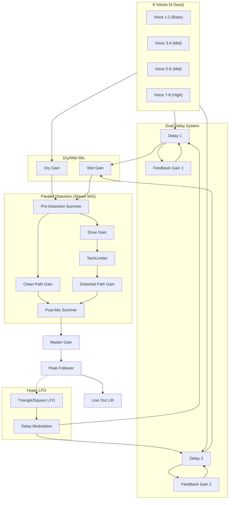

# Orpheus Audio Path Architecture

## Signal Flow Overview



## Key Components

### TanhLimiter (Soft Clipper)

The limiter is the core of the distortion/dynamics system. Located at [TanhLimiter.kt](file:///Users/balch/Source/Orpheus/composeApp/src/jvmMain/kotlin/org/balch/orpheus/core/audio/TanhLimiter.kt).

**Algorithm:**
```
output = tanh(input × drive)
compensation = 1.0 / tanh(min(drive, 3.0))
final = saturated × min(compensation, 1.5)
```

| Drive Value | Gain   | Character                  |
|-------------|--------|----------------------------|
| 1.0         | 1×     | Clean pass-through         |
| 3-5         | 3-5×   | Warm saturation            |
| 10+         | 10-15× | Heavy distortion, harmonic |

> [!NOTE]
> The tanh function provides **soft clipping** that naturally rolls off peaks without hard digital clipping. This creates odd harmonics similar to tube saturation.

### Metallic Quality Explanation

The "metallic" quality you're hearing is **expected behavior** when:
- **High drive values (>50%)** — More aggressive harmonic generation
- **Fast transients** — tanh saturation compresses peaks quickly
- **Combined with delay feedback** — Harmonics can accumulate

This is characteristic of tanh-based saturation and is musically valid for drone/ambient synthesis.

## Signal Routing (DspOrpheusEngine)

### Voice → Stereo Output Path

1. **8 Voices** → Each outputs to:
   - Both delay lines (wet path)
   - Dry path
   - **Per-voice pan gains (L/R)** → Stereo sum buses
2. **Dual Delays** → Independent feedback loops with LFO modulation
3. **Dry/Wet Mix** → Blends direct voice signal with delayed signal
4. **Pre-Distortion Summer** → Combines dry and wet paths
5. **Parallel Split:**
   - Clean Path: Direct passthrough with gain control
   - Distorted Path: Drive → TanhLimiter → Output gain
6. **Post-Mix Summer** → Blends clean and distorted paths → feeds **stereo bus**
7. **Stereo Sum L/R** → Collects panned voice signals
8. **Master Pan L/R** → Final stereo balance control
9. **Master Gain L/R** → Final stereo volume control
10. **Peak Follower** → Monitors left channel for feedback routing
11. **Line Out L/R** → True stereo output

### Per-Voice Panning (Equal-Power Law)

Each voice has dedicated L/R pan gains using equal-power panning:
```
angle = (pan + 1) / 2 × π/2
leftGain  = cos(angle)
rightGain = sin(angle)
```

| Voice   | Default Pan | Position     |
|---------|-------------|--------------|
| 1-2     | 0.0         | Center       |
| 3-4     | -0.3        | Slight Left  |
| 5-6     | +0.3        | Slight Right |
| 7-8     | ±0.7        | Wide L/R     |

### Stereo Modes

The stereo mode switch controls delay routing:

| Mode | Delay 1 | Delay 2 | Effect |
|------|---------|---------|--------|
| **Voice Pan** | Both L+R | Both L+R | Traditional mono wet mix |
| **Stereo Delays** | Left only | Right only | Ping-pong stereo effect |

Each delay has dedicated L/R wet gains (`delay1WetLeft/Right`, `delay2WetLeft/Right`) that are set by `setStereoMode()`:
- VOICE_PAN: All gains = 1.0 (delays to both channels)
- STEREO_DELAYS: D1→L=1.0, D1→R=0.0, D2→L=0.0, D2→R=1.0

### Modulation Routing

- **Hyper LFO** → Delay time modulation (converted to unipolar 0-1)
- **Peak Follower** → Total Feedback → LFO frequency modulation
- **Vibrato LFO** → All voice frequencies
- **Voice Coupling** → Partner envelope → frequency modulation

## Platform Implementations

| Platform | AudioEngine    | Limiter           | Status     |
|----------|----------------|-------------------|------------|
| JVM      | JSyn           | TanhLimiter       | ✅ Full    |
| Android  | Stub           | StubLimiter       | ⚠️ Stub    |
| wasmJs   | Not configured | N/A               | ❌ Disabled |

## Default Values

| Parameter          | Default | Range        |
|--------------------|---------|--------------|
| Drive              | 1.0     | 1.0 - 15.0   |
| Distortion Mix     | 0.5     | 0.0 - 1.0    |
| Dry/Wet Mix        | 0.5     | 0.0 - 1.0    |
| Master Volume      | 0.7     | 0.0 - 1.0    |
| Delay Feedback     | 0.95×   | 0.0 - 0.95   |
| Peak Follower τ    | 0.1s    | Half-life    |

## Related Documentation

- [Distortion Test Plan](file:///Users/balch/Source/Orpheus/test_plans/distortion_test_plan.md) — Comprehensive test cases
- [DspSynthEngine.kt](file:///Users/balch/Source/Orpheus/composeApp/src/commonMain/kotlin/org/balch/orpheus/core/audio/dsp/DspSynthEngine.kt) — Main audio routing
- [DspVoice.kt](file:///Users/balch/Source/Orpheus/composeApp/src/commonMain/kotlin/org/balch/orpheus/core/audio/dsp/DspVoice.kt) — Voice implementation
