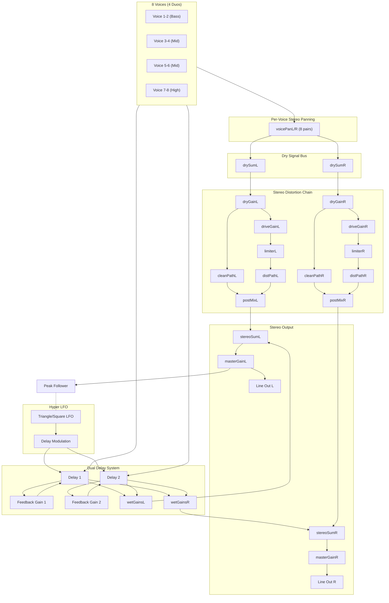

# Orpheus Audio Path Architecture

## Signal Flow Overview



## Key Changes (Dec 2024)

> [!IMPORTANT]
> The signal path was refactored to eliminate **signal doubling** that was causing muddiness in low frequencies. The previous architecture sent voices to both the dry path AND the stereo bus via panning, effectively doubling the signal.

**Old (Broken) Path:**
```
Voice → dryGain (mono) → distortion → stereoSum
Voice → voicePan → stereoSum  ← DUPLICATE!
```

**New (Fixed) Path:**
```
Voice → voicePan → drySumL/R → dryGain (stereo) → distortion (stereo) → stereoSum
Voice → delays → wetGains → stereoSum
```

## Key Components

### TanhLimiter (Soft Clipper)

The limiter is the core of the distortion/dynamics system. Now implemented in **stereo** with `limiterLeft` and `limiterRight`. Located at [TanhLimiter.kt](file:///Users/balch/Source/Orpheus/composeApp/src/jvmMain/kotlin/org/balch/orpheus/core/audio/TanhLimiter.kt).

**Algorithm:**
```
output = tanh(input × drive)
compensation = 1.0 / tanh(min(drive, 3.0))
final = saturated × min(compensation, 1.5)
```

| Drive Value | Gain   | Character                  |
|-------------|--------|----------------------------|
| 1.0         | 1×     | Clean pass-through         |
| 3-5         | 3-5×   | Warm saturation            |
| 10+         | 10-15× | Heavy distortion, harmonic |

> [!NOTE]
> The tanh function provides **soft clipping** that naturally rolls off peaks without hard digital clipping. This creates odd harmonics similar to tube saturation.

### Stereo Distortion Chain

The distortion chain is now fully stereo to preserve per-voice panning:

| Component | Left | Right |
|-----------|------|-------|
| Dry Sum | `drySumLeft` | `drySumRight` |
| Dry Gain | `dryGainLeft` | `dryGainRight` |
| Drive | `driveGainLeft` | `driveGainRight` |
| Limiter | `limiterLeft` | `limiterRight` |
| Clean Path | `cleanPathGainLeft` | `cleanPathGainRight` |
| Dist Path | `distortedPathGainLeft` | `distortedPathGainRight` |
| Post Mix | `postMixSummerLeft` | `postMixSummerRight` |

## Signal Routing (DspSynthEngine)

### Voice → Stereo Output Path

1. **8 Voices** → Each outputs to:
   - Both delay lines (wet path)
   - Per-voice pan gains (L/R) → **drySumL/R** (NOT stereoSum directly!)
2. **Per-Voice Panning** → voicePanL/R with equal-power pan law
3. **Dry Sum Buses** → Collect all panned voice signals (stereo)
4. **Stereo Dry Gain** → Controls dry level for both channels
5. **Parallel Split (Stereo):**
   - Clean Path L/R: Direct passthrough with gain control
   - Distorted Path L/R: Drive → TanhLimiter → Output gain
6. **Post-Mix Summer L/R** → Blends clean and distorted paths per channel
7. **Dual Delays** → Independent feedback loops with LFO modulation
8. **Stereo Wet Gains** → delay1WetL/R, delay2WetL/R → stereoSumL/R
9. **Stereo Sum L/R** → Combines dry path output + wet path
10. **Master Pan L/R** → Final stereo balance control
11. **Master Gain L/R** → Final stereo volume control
12. **Peak Follower** → Monitors left channel for feedback routing
13. **Line Out L/R** → True stereo output

### Critical Routing Rules

> [!CAUTION]
> These rules prevent signal doubling and phase issues:

1. **Wet signal** goes ONLY through stereo wet gains (`delay1WetLeft`, etc.)
2. **NO duplicate paths** - each signal should reach stereoSum exactly once
3. **Dry path**: Voice → voicePan → drySum → distortion → stereoSum (stereo all the way)
4. **Wet path** bypasses distortion, goes directly to stereoSum
5. **Voice pan gains** provide per-voice stereo positioning **BEFORE** distortion

### Per-Voice Panning (Equal-Power Law)

Each voice has dedicated L/R pan gains using equal-power panning:
```
angle = (pan + 1) / 2 × π/2
leftGain  = cos(angle)
rightGain = sin(angle)
```

| Voice   | Default Pan | Position     |
|---------|-------------|--------------|
| 1-2     | 0.0         | Center       |
| 3-4     | -0.3        | Slight Left  |
| 5-6     | +0.3        | Slight Right |
| 7-8     | ±0.7        | Wide L/R     |

### Stereo Modes

The stereo mode switch controls delay routing:

| Mode | Delay 1 | Delay 2 | Effect |
|------|---------|---------|--------|
| **Voice Pan** | Both L+R | Both L+R | Traditional mono wet mix |
| **Stereo Delays** | Left only | Right only | Ping-pong stereo effect |

Each delay has dedicated L/R wet gains (`delay1WetLeft/Right`, `delay2WetLeft/Right`) that are set by `setStereoMode()`:
- VOICE_PAN: All gains = wetLevel (delays to both channels)
- STEREO_DELAYS: D1→L=wetLevel, D1→R=0.0, D2→L=0.0, D2→R=wetLevel

### Modulation Routing

- **Hyper LFO** → Delay time modulation (converted to unipolar 0-1)
- **Peak Follower** → Total Feedback → LFO frequency modulation
- **Vibrato LFO** → All voice frequencies
- **Voice Coupling** → Partner envelope → frequency modulation

## Platform Implementations

| Platform | AudioEngine    | Limiter           | Status     |
|----------|----------------|-------------------|------------|
| JVM      | JSyn           | TanhLimiter (×2)  | ✅ Full    |
| Android  | Stub           | StubLimiter       | ⚠️ Stub    |
| wasmJs   | Not configured | N/A               | ❌ Disabled |

## Default Values

| Parameter          | Default | Range        |
|--------------------|---------|--------------|
| Drive              | 1.0     | 1.0 - 15.0   |
| Distortion Mix     | 0.5     | 0.0 - 1.0    |
| Dry/Wet Mix        | 0.5     | 0.0 - 1.0    |
| Master Volume      | 0.7     | 0.0 - 1.0    |
| Delay Feedback     | 0.95×   | 0.0 - 0.95   |
| Peak Follower τ    | 0.1s    | Half-life    |

## Related Documentation

- [Distortion Test Plan](file:///Users/balch/Source/Orpheus/test_plans/distortion_test_plan.md) — Comprehensive test cases
- [DspSynthEngine.kt](file:///Users/balch/Source/Orpheus/composeApp/src/commonMain/kotlin/org/balch/orpheus/core/audio/dsp/DspSynthEngine.kt) — Main audio routing
- [DspVoice.kt](file:///Users/balch/Source/Orpheus/composeApp/src/commonMain/kotlin/org/balch/orpheus/core/audio/dsp/DspVoice.kt) — Voice implementation
