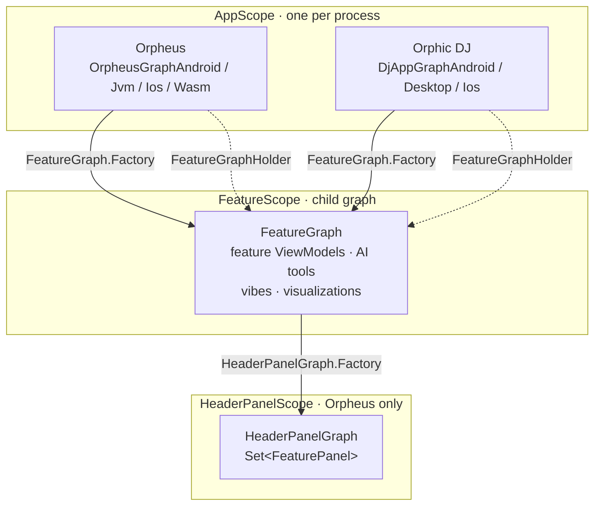

# DI Architecture

Both apps use [Metro](https://github.com/ZacSweers/metro). There are seven `@DependencyGraph`
declarations and two `@GraphExtension` child graphs. This doc lists what each component is, why it
exists, and what the two apps wire differently.

Adding a feature normally means one thing: contribute it to `FeatureScope`. The rest is for when
that is not enough.



Solid arrows are Metro graph extensions. Dotted arrows are the runtime path: `FeatureGraphHolder` is
the only caller of `FeatureGraph.Factory.create()` in production code.

## Graphs

| Graph | Declared in | Why there |
|---|---|---|
| `OrpheusGraph` | `apps/orpheus/shared` commonMain | Plain interface, not a graph. Holds the members every platform needs so they cannot drift per platform. |
| `OrpheusGraphAndroid` | `apps/orpheus/shared` androidMain | Sees `AndroidRepositoryModule`, `OboeAudioEngine`, `AndroidTtsGenerator`, Android `VibeCatalogPolicyProvider`. |
| `OrpheusGraphJvm` | `apps/orpheus/shared` jvmMain | Sees `JvmRepositoryModule`, `AudioEngineProvider`, `JvmTtsGenerator`, `DesktopHandTracker`. |
| `OrpheusGraphIos` | `apps/orpheus/shared` iosMain | Sees `IosRepositoryModule`, `IosAudioEngine`, `IosTtsGenerator`. |
| `OrpheusGraphWasm` | `apps/orpheus/shared` wasmJsMain | Sees `WasmRepositoryModule`, `WasmNativeAudioEngine`, `WasmDispatcherProvider`. |
| `DjAppGraph` | `apps/djapp/shared` commonMain | Plain interface, same role as `OrpheusGraph`. |
| `DjAppGraphAndroid` | `apps/djapp/androidApp` | Entry module, so `:apps:djapp:ai` is on the classpath for the `ai` flavor. |
| `DjAppGraphDesktop` | `apps/djapp/desktopApp` | Entry module, so `:apps:djapp:ai` is on the classpath with `-Pedition=ai`. |
| `DjAppGraphIos` | `apps/djapp/shared` iosMain | iOS links the `DjAppShared` framework directly and has no entry module, so this is Core edition only. |

### Why placement matters

Metro merges `@ContributesTo` and `@ContributesInto*` at the module declaring the
`@DependencyGraph`. Contributions not on that module's compile classpath are not merged and no error
is reported. Two consequences follow:

1. A graph in `commonMain` cannot see `androidMain` / `jvmMain` / `iosMain` / `wasmJsMain`, so
   Orpheus declares one graph per platform source set. This is the pattern in Metro's
   `docs/multiplatform.md`.
2. `:apps:djapp:ai` depends on `:apps:djapp:shared`, so a graph in `shared` is upstream of the AI
   module and cannot see `AiTabContribution` or `DjAiViewModel`. The DJ graphs therefore live in the
   entry modules. The `og` flavor has no `ai` module on its classpath, which is what keeps `INTERNET`
   and the AI dependencies out of that edition.

## Scopes

| Scope | Graph | Lifetime | Holds |
|---|---|---|---|
| `AppScope` | the app graph | process | Audio engine, `SynthController`, `PlaybackController`, media session, repositories, DSP plugins |
| `FeatureScope` | `FeatureGraph` | per `create()` call | Feature ViewModels, AI tools, vibe providers, visualizations, `FeatureCollection`, `FeatureCoroutineScope`, `FeatureStatePersistence` |
| `HeaderPanelScope` | `HeaderPanelGraph` | per `create()` call | `Set<FeaturePanel>` for the Orpheus collapsible header |

Child graphs inherit parent bindings, so a FeatureScope ViewModel can inject `SynthController` or
`SynthEngine`. The reverse does not work, which is what keeps feature code out of `AppScope`.

`HeaderPanelScope` exists so panel registrations do not leak into apps with no header. The DJ app has
no graph at that scope, so its `@ContributesIntoSet(HeaderPanelScope::class)` contributions are never
merged and no synthetic Set is emitted.

## Supporting types

| Type | Scope | Why it exists |
|---|---|---|
| `FeatureGraphHolder` | `AppScope` | Calls `FeatureGraph.Factory.create()` once behind a `lazy` and caches it. Without it, the Compose tree and the Android `MediaBrowserService` would each build their own child graph and their own `PulsarViewModel`, and the second one's `init` would overwrite `MediaSessionManager`'s callback slots. |
| `FeatureCollection` | `FeatureScope` | Typed index over the `KClass<out SynthFeature<*, *>> -> () -> SynthFeature` multibinding, for iteration (`allFeatures`, `keyActions`) and for the non-DI composable lookup path. Holds **no state and no lock** — instance identity belongs to Metro. Adding a cache here reintroduces the startup deadlock. |
| `SynthFeatureKey` | n/a | Map key for the feature multibinding, typed `KClass<out SynthFeature<*, *>>`. Features register under their **public interface**, so the key and the looked-up type are the same symbol. |
| `SynthFeatureRegistry` | `AppScope`, in the ViewModel map | A `ViewModel`-shaped accessor so Compose can reach the feature graph through `ViewModelStore`. Deliberately does not override `onCleared`, because the graph outlives the Activity. |
| `InjectedViewModelFactory` | `AppScope` | Backs `MetroViewModelFactory` from the three `MetroViewModelMultibindings` maps. Lives in `:core:features` so both apps get it with no per-app wiring. |
| `HeaderPanelGraph` | `HeaderPanelScope` | Materializes `Set<FeaturePanel>`. Created by `HeaderViewModel`. |

Note that `SynthFeatureRegistry` is the only entry in the AndroidX ViewModel map. Feature ViewModels
are not AndroidX ViewModels; they are `SynthFeature` implementations reached through
`FeatureCollection`.

## FeatureScope in practice

`FeatureGraph` is a `@GraphExtension`, so `create()` returns a **new** child graph on every call,
each with its own copy of every `@SingleIn(FeatureScope::class)` binding. Verified in the generated
bytecode: `DjAppGraphDesktop$Impl.create()` is an unconditional
`new FeatureGraphImpl(parent)`, and `FeatureGraphImpl` holds `featureCollectionProvider`,
`featureCoroutineScopeProvider` and `featureStatePersistenceProvider` as its own instance fields.

### Worked example: two Pulsar panels

Say you want an A/B deck with two Pulsar panels side by side. The DI side is one call:

```kotlin
// NOT what the apps do today. FeatureGraphHolder deliberately creates exactly one.
val deckA = featureGraphFactory.create()
val deckB = featureGraphFactory.create()

val pulsarA: PulsarFeature = deckA.featureCollection.getFeature(PulsarFeature::class)
val pulsarB: PulsarFeature = deckB.featureCollection.getFeature(PulsarFeature::class)
// pulsarA !== pulsarB
```

What you get from that:

- Two distinct `PulsarViewModel` instances.
- Two `FeatureCoroutineScope`s, so cancelling one deck does not touch the other.
- Two `FeatureStatePersistence` instances and two `FeatureCollection` caches.
- Two of every other feature in that graph as well, since the whole child graph is duplicated.

What you do **not** get, and this is the part that decides whether the idea is viable:

- **Two beat machines.** `PulsarViewModel` binds its state to global control IDs
  (`PulsarSymbol.PLAYING.controlId` and friends). `SynthController.controlFlow(id)` is
  `_controlFlows.getOrPut(id)` on an `AppScope` singleton, so both ViewModels receive the *same*
  `MutableStateFlow` per control. Writing energy on deck A moves the port that deck B is projecting
  from, and both panels update.
- **Two DSP voices.** `DefaultWiringGraph` instantiates exactly one `pulsar("pulsar")` unit. Both
  ViewModels drive that single unit.

So two child graphs give you two independent controllers over one shared engine, which is useful for
independent UI state but is not an A/B deck. Making it a real A/B deck needs three things beyond DI:
per-instance control IDs (a symbol namespace or instance index), a second `pulsar()` unit in the
wiring graph, and a second set of ports in the C++ unit. `FeatureScope` removes the DI obstacle; the
audio path is the actual work.

### Feature ViewModels are FeatureScope singletons

Every feature ViewModel carries four annotations:

```kotlin
@Inject
@SingleIn(FeatureScope::class)
@SynthFeatureKey(LfoFeature::class)
@ContributesIntoMap(FeatureScope::class, binding = binding<SynthFeature<*, *>>())
@ContributesBinding(FeatureScope::class, binding = binding<LfoFeature>())
class LfoViewModel(...) : LfoFeature
```

- `@SingleIn` is what makes it single-instance. Metro memoizes it in a `DoubleCheck` provider field
  on the generated `FeatureGraphImpl`.
- `@ContributesIntoMap` puts it in the multibinding, which backs `FeatureCollection.allFeatures`,
  and through that `keyActions` (keyboard dispatch) and the AI tools' `synthControl` descriptors.
- `@ContributesBinding` makes the interface directly injectable.

**The map entry and the direct binding are the same object.** Confirmed in bytecode: the provider
field is `getfield`'d straight into the multibinding's `MapProviderFactory.Builder.put`, so
`getFeature(LfoFeature::class)` and an injected `LfoFeature` cannot diverge.

```
getfield      lfoViewModelProvider
invokevirtual MapProviderFactory$Builder.put
```

**Instance identity belongs to Metro, not to `FeatureCollection`.** The collection used to keep its
own cache, which was a second memoization layer over the same objects. Because it held its lock
across `provider()` — arbitrary ViewModel construction that re-enters DI — a Metro `DoubleCheck`
taken in the opposite order on another thread produced an AB-BA deadlock that hung startup. See the
`FeatureCollection.lock` history and `FeatureProviderScopeGuardTest`. The collection is now a pure
index: **never give it a cache or a lock.**

**A missing `@SingleIn` fails silently.** Metro is perfectly happy to build an unscoped binding; it
just hands out a fresh ViewModel per resolve. Feature ViewModels register themselves with `AppScope`
singletons in their `init` blocks — `MediaSessionManager`'s callback slots are `var` fields — so the
second instance overwrites the first and the notification drives a ViewModel the UI never observes.
`FeatureScopeGuardTest` fails the build for a missing scope, and for a `@SynthFeatureKey` naming an
interface the class does not implement.

**Injecting by concrete ViewModel type is still wrong.** Inject the interface (`LfoFeature`), never
`LfoViewModel`. The key is the interface, so a lookup by ViewModel class fails at runtime.

### Who injects and who looks up

| Consumer | How it gets the feature |
|---|---|
| `*PanelRegistration` (a Metro `@Inject` class in `HeaderPanelScope`) | constructor injection |
| Panel composables | a parameter, passed down by the registration |
| `App.kt`, `*Screen.kt`, `DjAppScreen.kt` | `LocalSynthFeatures` — no constructor to inject into |
| AI tools, `keyActions` | `FeatureCollection.allFeatures` |

18 features still expose a companion `feature()` accessor, purely because a non-DI composable reads
them. The other 15 dropped theirs. Before deleting an accessor, check for **both** spellings —
`XViewModel.feature()` and `registry.feature<XFeature>()`. Searching only one misclassified four
features during the original migration.

## What the two apps wire differently

Same feature modules, same DSP engine, different bindings:

| Binding | Orpheus | Orphic DJ |
|---|---|---|
| `WiringGraphProvider` | `buildDefaultWiringGraph()` | `buildDjAppWiringGraph()` |
| `RestoreStrategy` | `PRESET` | `USER_PREFERENCES` |
| `PulsarPlaybackMode` | `MIX_GATED`. The VM sets `PULSAR_PLAYING=1` on vibe load and the mix knob controls audibility. | `EXPLICIT`. Mix stays at 1 and the play button gates audio. |
| `AgentGreetingMode` | `ON_START` | `ON_FIRST_PROMPT` |
| `MetadataProducer` | `OrpheusMetadataProducer` | `PulsarMetadataProducer` |
| `PlayFromMediaIdHandler?` | `null`, no browse tree | `PulsarVibePicker` |
| `SynthPresetRepository` | real per-platform implementations | no-op stub, the DJ app has no preset UI |
| `HeaderPanelScope` | has a graph | no graph |
| `Set<DjTabContribution>` | not present | `ai` edition only, `@Multibinds(allowEmpty = true)` |

## Startup construction

Metro builds a binding the first time something asks for it. A singleton whose `init {}` installs
flow collectors or registers platform callbacks is never constructed if nothing injects it, and
nothing reports the omission. Two things force construction anyway, and they are declared
differently because they have different material to work with.

| | Feature ViewModels | App-scope roots |
|---|---|---|
| Declared by | `startup = true` on `@SynthFeatureKey` | `binding<@StartupRoot Any>()` |
| Lives in | `FeatureScope` (child graph) | `AppScope` |
| Read by | `FeatureCollection.startupFeatures` | `StartupInitializer`'s constructor |
| Why that way | the class already carries a registration annotation | nothing to widen, so it gets a qualifier |

Both are **one declaration site**. Neither has a state where you can declare half of it.

### The flag rides the registration, not the feature

```kotlin
@MapKey(unwrapValue = false)
annotation class SynthFeatureKey(
    val value: KClass<out SynthFeature<*, *>>,
    val startup: Boolean = false,
)
```

```kotlin
@SynthFeatureKey(TimerFeature::class, startup = true)
@ContributesIntoMap(FeatureScope::class, binding = binding<SynthFeature<*, *>>())
class TimerViewModel(...) : TimerFeature
```

`unwrapValue = false` makes the whole annotation instance the map key, so the multibinding is
`Map<SynthFeatureKey, () -> SynthFeature<*, *>>` and the flag is readable straight off the key:

```kotlin
val startupFeatures: List<SynthFeature<*, *>>
    get() = providers.entries.filter { it.key.startup }.map { it.value() }
```

Filtering happens **before any provider is invoked**, so only the marked features are built.

**Why not a marker interface, or a boolean on `SynthFeature`?** Both were tried. Both put the answer
inside the thing being decided about: a marker on the type is readable only through an instance or
through reflection, and a property on the instance is readable only through an instance. Either way
you must construct a feature to learn whether to construct it. KMP common `KClass` cannot break the
loop — it exposes `simpleName`, `qualifiedName`, and `isInstance(value)`, but no subtype check
(`isSubclassOf` is `kotlin.reflect.full`, JVM-only, so iOS and wasm are out). The registration is
the one place the answer exists before construction, and Metro materializes it at graph-build time.

A marker interface also leaked: `DistortionViewModel.previewFeature()` returns
`object : DistortionFeature { ... }`, so a preview stub silently became a startup feature. A flag on
the key cannot do that.

### App-scope roots

Roots carry no registration annotation to widen, so they get a qualifier and a set of their own:

```kotlin
@ContributesIntoSet(AppScope::class, binding = binding<@StartupRoot Any>())
class PlaybackController(...) : MediaSessionActionHandler
```

The bound type is `Any` deliberately. Nothing ever calls a method on a member of that set —
construction is the whole contract — so a named marker interface would only be a second place to
declare the same fact. `StartupRoot` needs `AnnotationTarget.TYPE` in its `@Target` list so the
qualifier can ride the `binding<...>` type argument; Kotlin's default target set omits `TYPE`.

### The inventory

| `@StartupRoot` (`AppScope`) | `startup = true` (`FeatureScope`) |
|---|---|
| `PlaybackController` | `ReverbViewModel` |
| `PulsarPlaybackBridge` | `HornViewModel` |
| `PulsarSongEnding` | `TimerViewModel` |
| `PulsarSongAdvancer` | `DjViewModel` |
| `AndroidAppLifecycleManager` (Orpheus, Android only) | `MixerViewModel` |
| `DjAppLifecycleManager` (Orphic DJ, Android only) | `PulsarViewModel` |
| `InAppReviewManager` (Orphic DJ, Android only) | |

`DistortionViewModel` restores engine ports in `onRestore` too, but is deliberately left
`startup = false`: it writes `DistortionSymbol.DRIVE` and `MIX`, the same two ports
`MixerViewModel`'s DIST fader owns and restores from a different persisted key. Building both at
startup makes the result last-writer-wins, and `DistortionUiState` defaults those ports to `0.0f`,
so a saved DIST value could be silently zeroed. `FeatureStartupGuardTest` carries the file name in
`DELIBERATELY_LAZY_RESTORERS` so its `onRestore` nag stays quiet.

That removes the race in the DJ app, which has no Distortion panel and never builds the ViewModel at
all. In Orpheus it only *reorders* it: both still construct, `MixerViewModel` now runs first, and
`DistortionViewModel` arrives later via its panel or via `keyActions` draining `allFeatures` — so it
is reliably the last writer where it used to be whatever registration order produced. A saved
Orpheus DIST value coming back as `0.0f` is the symptom to watch for; the fix would be for one of
the two to stop owning the port.

That same `onRestore` also writes `StereoSymbol.MASTER_VOL` and `MASTER_PAN`, so those two ports go
neither restored nor persisted in the DJ app now that the ViewModel never constructs there — a
behavior change. It is harmless and arguably a bugfix: `DistortionUiState`'s defaults
(`volume = 0.7f`, `masterPan = 0f`) match `StereoPlugin`'s port defaults exactly, and it removes a
latent bug where a DJ app killed mid-timer-fade persisted `volume` near `0` and silently restored a
muted app.

`PulsarViewModel` is `startup = true` for a reason no rule can infer: it registers
`MediaSessionManager` callbacks in `init {}` and has no `onRestore` at all. Dropping its flag breaks
lock-screen transport, and no test catches that.

`PulsarPlaybackBridge` is easy to mistake for an Android concern. Every platform has a real media
session behind `MediaSessionManager`: media3 on Android, `MacOsNowPlaying` on desktop,
`MPNowPlayingInfoCenter` on iOS, `navigator.mediaSession` on web. The bridge is the only caller of
`MediaSessionStateManager.setPulsarActive`, one of the seven inputs to `isMediaSessionNeeded`. If it
is absent, Pulsar never registers as an audio-activity source, so the session deactivates when the
timer or Evo stops even though the beat machine is still running.

### `StartupInitializer.run()`

One class, one call, injected on the app-level graph interface (`OrpheusGraph.startupInitializer`,
`DjAppGraph.startupInitializer`) and invoked once from every entry point —
`OrpheusApplication.onCreate`, `desktopApp/main.kt`, `main.ios.kt`, `main.wasmJs.kt`, and the DJ
equivalents:

```kotlin
graph.startupInitializer.run()
```

Ordering falls out of construction order rather than a priority field: the constructor takes
`@StartupRoot roots: Set<Any>`, so every root is already built by the time `run()` is entered.
`run()` then reads `holder.featureGraph.featureCollection.startupFeatures`.

Root construction does **not** stay inside `AppScope`, despite happening in an `AppScope`
constructor. `PulsarSongAdvancer` injects `PulsarFeature` eagerly, and the `AppScope` provider for
it is `holder.featureGraph.featureCollection.getFeature(...)` — so building the root set already
enters `FeatureGraphHolder`'s lazy and constructs `PulsarViewModel`, before `run()` is reached. A
new root must not assume otherwise.

What the split *does* buy is narrow, and the drain's placement does the heavy lifting: it lives
inside `run()` and
deliberately **not** inside `FeatureGraphHolder`'s
`val featureGraph: FeatureGraph by lazy { factory.create() }`. Kotlin's `SynchronizedLazyImpl` is
not re-entrant — it checks `_value !== UNINITIALIZED` inside its own lock, and `synchronized`
re-enters freely on the same thread, so a same-thread re-entry during initialization finds the value
still unset and recurses without bound. Root construction is safe today only because
`factory.create()` builds no members of its own. Draining after `create()` has already published its
result cannot hit that at all.

The startup log line records what actually got built:

```
startup init: N app roots, M features
```

On DJ desktop, `N` is 4 (`PlaybackController`, `PulsarPlaybackBridge`, `PulsarSongEnding`,
`PulsarSongAdvancer`; the three Android-only roots are absent from that classpath) and `M` is 6.

### `getFeature` goes through a derived index

`SynthFeatureKey` is the map key now, so `providers[SomeFeature::class]` no longer type-checks.
`FeatureCollection` builds a `KClass -> provider` index lazily from the keys alone — no provider is
invoked, so it constructs nothing — and `getFeature` reads that. Callers are unchanged.

### The two guards, and what neither one catches

`StartupRootGuardTest` and `FeatureStartupGuardTest` (both `core/features/src/jvmTest`):

- **`FeatureStartupGuardTest` nags.** With one declaration site there is no half-done state to
  catch, so the only job left is the one a compiler cannot do: notice a feature that *should* be
  `startup = true`. It infers that from `onRestore =`, the signature of a port-restoring
  `persistence.bind(...)` call, and fails if a matching file lacks the flag.
  `DELIBERATELY_LAZY_RESTORERS` holds the one deliberate exception. **KNOWN LIMIT:** the inference
  catches port-restorers, not callback-registrars, so `PulsarViewModel`'s flag is unguarded.
- **`StartupRootGuardTest` pins, it does not infer.** Two heuristics for "is this `AppScope`
  singleton a startup root" were measured against this repo before the test was written. The best —
  `@SingleIn(AppScope::class)` whose `init` contains `.launch` — produced 9 false positives and 2
  false negatives out of 14 matches. The false positives (`SynthOrchestrator`,
  `MediaSessionStateManager`, `PulsarSession`, `PulsarMetadataProducer`, `PulsarSkipHandler`,
  `TidalScheduler`, `SongEndingPreferences`, `TransitionPreferences`, `AiModelProvider`) all have
  real injectors and are constructed anyway. The false negatives were `AndroidAppLifecycleManager`
  and `DjAppLifecycleManager`, whose `init` registers activity-lifecycle callbacks instead of
  launching a coroutine — the two most easily forgotten. The distinguishing question, "does anything
  else already inject this?", is a property of the whole binding graph and is invisible in the file
  being scanned. So the test hardcodes the seven-class inventory and fails if source and list
  diverge in either direction.

A third check, `noEntryPointTouchesRootsByHand`, pins the seven entry points and fails if any still
references a removed per-root accessor, or has stopped calling `graph.startupInitializer.run()` —
the one thing no source-level wiring check can see.

**These guards scan the repo tree at runtime through `java.io.File`, which Gradle cannot see.**
`core/features/build.gradle.kts` declares `core/**`, `features/**`, and `apps/**` as an explicit
task input. Without it, `:core:features:jvmTest` is `UP-TO-DATE` whenever only *other* modules
changed — meaning dropping a feature's `startup` flag would not re-run the guards locally or in an
incremental CI. If you add another repo-scanning guard in this module it inherits the declaration;
one in a different module does not.

Watch the regexes when the key shape changes. `FeatureScopeGuardTest`'s `KEY` pattern used to end in
`::class\)`, which silently stopped matching every startup feature the moment a second argument was
added — caught only because that test carries a `MIN_FEATURE_VIEWMODELS` floor.

### Why Orpheus used to get this by accident, and Orphic DJ did not

Before this mechanism existed, most Orpheus features got constructed without anyone declaring
intent: `FeatureCollection.keyActions` (keyboard dispatch) is `by lazy`, and building it iterates
`allFeatures`, which drains every provider in the multibinding. So reading a keyboard shortcut on
the Orpheus desktop/JVM UI happened to construct every feature ViewModel as a side effect. The DJ
app has no keyboard handling and never reads `keyActions` or `allFeatures`, so nothing forced
construction there — a saved Reverb setting silently failed to apply until the user visited the
Reverb tab. The `startup` flag replaces that accident with a declared contract that holds identically
on both apps and every platform.

## Constraints

- **`T` and `T?` are distinct type keys.** A `Foo` binding does not satisfy a `Foo?` parameter. If
  the parameter has a default (`foo: Foo? = null`) there is no error and the default is used.
  `PlaybackController` takes five such parameters. `DspSynthEngine` contributes both
  `binding<AudioRouteMonitor>()` and `binding<AudioRouteMonitor?>()` for this reason.
- **`@Binds` cannot carry a scope.** Put `@SingleIn(AppScope::class)` on the implementation class,
  which also scopes the concrete type.
- **Empty multibindings are an error by default**, unlike Dagger. Declare
  `@Multibinds(allowEmpty = true)` when empty is legitimate.
- **Platform overrides need `replaces`.** `JvmAiVibeArchive` and `AndroidAiVibeArchive` both use
  `@ContributesBinding(AppScope::class, replaces = [NoOpAiVibeArchive::class])`.
- **AppScope bindings that need a feature take `() -> T`.** `PulsarSkipHandler` and the vibe tools
  take `pulsarFeatureProvider: () -> PulsarFeature`. Injecting the feature eagerly pulls the child
  graph into `AppScope` construction and Metro stack-overflows.

## Verifying a change

Metro validates the binding graph at compile time, so compiling every variant is a real check:

```bash
./gradlew :apps:orpheus:desktopApp:compileKotlin \
          :apps:orpheus:androidApp:compileDebugKotlin \
          :apps:orpheus:webApp:compileKotlinWasmJs \
          :apps:orpheus:shared:compileKotlinIosSimulatorArm64 \
          :apps:djapp:desktopApp:compileKotlin \
          :apps:djapp:androidApp:compileOgDebugKotlin \
          :apps:djapp:androidApp:compileAiDebugKotlin \
          :apps:djapp:shared:compileKotlinIosSimulatorArm64
./gradlew :apps:djapp:desktopApp:compileKotlin -Pedition=ai
```

Compiling does not check two things: whether an eager root is actually touched, and whether a
defaulted nullable parameter found its binding. Read the generated graph for those:

```bash
javap -p -c -classpath apps/djapp/desktopApp/build/classes/kotlin/main \
  'org.balch.orpheus.djapp.DjAppGraphDesktop$Impl' | grep -A30 'MetroFactory'
```

A parameter that resolved shows a real `Provider` field at the call site. A parameter that silently
fell back to its default does not.
