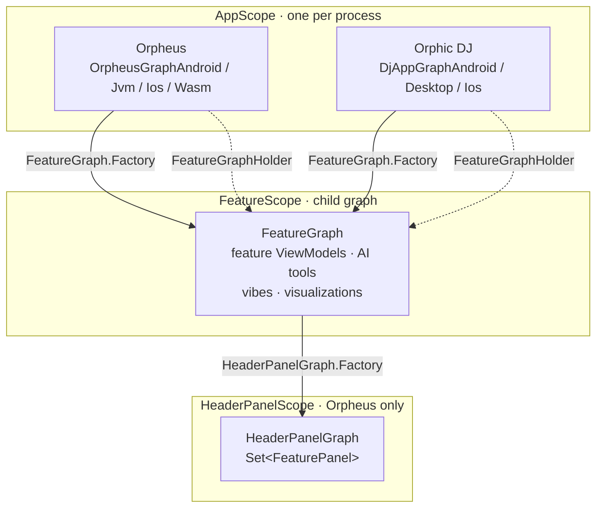

# DI Architecture

Both apps use [Metro](https://github.com/ZacSweers/metro). There are seven `@DependencyGraph`
declarations and two `@GraphExtension` child graphs. This doc lists what each component is, why it
exists, and what the two apps wire differently.

Adding a feature normally means one thing: contribute it to `FeatureScope`. The rest is for when
that is not enough.



Solid arrows are Metro graph extensions. Dotted arrows are the runtime path: `FeatureGraphHolder` is
the only caller of `FeatureGraph.Factory.create()` in production code.

## Graphs

| Graph | Declared in | Why there |
|---|---|---|
| `OrpheusGraph` | `apps/orpheus/shared` commonMain | Plain interface, not a graph. Holds the members every platform needs so they cannot drift per platform. |
| `OrpheusGraphAndroid` | `apps/orpheus/shared` androidMain | Sees `AndroidRepositoryModule`, `OboeAudioEngine`, `AndroidTtsGenerator`, Android `VibeCatalogPolicyProvider`. |
| `OrpheusGraphJvm` | `apps/orpheus/shared` jvmMain | Sees `JvmRepositoryModule`, `AudioEngineProvider`, `JvmTtsGenerator`, `DesktopHandTracker`. |
| `OrpheusGraphIos` | `apps/orpheus/shared` iosMain | Sees `IosRepositoryModule`, `IosAudioEngine`, `IosTtsGenerator`. |
| `OrpheusGraphWasm` | `apps/orpheus/shared` wasmJsMain | Sees `WasmRepositoryModule`, `WasmNativeAudioEngine`, `WasmDispatcherProvider`. |
| `DjAppGraph` | `apps/djapp/shared` commonMain | Plain interface, same role as `OrpheusGraph`. |
| `DjAppGraphAndroid` | `apps/djapp/androidApp` | Entry module, so `:apps:djapp:ai` is on the classpath for the `ai` flavor. |
| `DjAppGraphDesktop` | `apps/djapp/desktopApp` | Entry module, so `:apps:djapp:ai` is on the classpath with `-Pedition=ai`. |
| `DjAppGraphIos` | `apps/djapp/shared` iosMain | iOS links the `DjAppShared` framework directly and has no entry module, so this is Core edition only. |

### Why placement matters

Metro merges `@ContributesTo` and `@ContributesInto*` at the module declaring the
`@DependencyGraph`. Contributions not on that module's compile classpath are not merged and no error
is reported. Two consequences follow:

1. A graph in `commonMain` cannot see `androidMain` / `jvmMain` / `iosMain` / `wasmJsMain`, so
   Orpheus declares one graph per platform source set. This is the pattern in Metro's
   `docs/multiplatform.md`.
2. `:apps:djapp:ai` depends on `:apps:djapp:shared`, so a graph in `shared` is upstream of the AI
   module and cannot see `AiTabContribution` or `DjAiViewModel`. The DJ graphs therefore live in the
   entry modules. The `og` flavor has no `ai` module on its classpath, which is what keeps `INTERNET`
   and the AI dependencies out of that edition.

## Scopes

| Scope | Graph | Lifetime | Holds |
|---|---|---|---|
| `AppScope` | the app graph | process | Audio engine, `SynthController`, `PlaybackController`, media session, repositories, DSP plugins |
| `FeatureScope` | `FeatureGraph` | per `create()` call | Feature ViewModels, AI tools, vibe providers, visualizations, `FeatureCollection`, `FeatureCoroutineScope`, `FeatureStatePersistence` |
| `HeaderPanelScope` | `HeaderPanelGraph` | per `create()` call | `Set<FeaturePanel>` for the Orpheus collapsible header |

Child graphs inherit parent bindings, so a FeatureScope ViewModel can inject `SynthController` or
`SynthEngine`. The reverse does not work, which is what keeps feature code out of `AppScope`.

`HeaderPanelScope` exists so panel registrations do not leak into apps with no header. The DJ app has
no graph at that scope, so its `@ContributesIntoSet(HeaderPanelScope::class)` contributions are never
merged and no synthetic Set is emitted.

## Supporting types

| Type | Scope | Why it exists |
|---|---|---|
| `FeatureGraphHolder` | `AppScope` | Calls `FeatureGraph.Factory.create()` once behind a `lazy` and caches it. Without it, the Compose tree and the Android `MediaBrowserService` would each build their own child graph and their own `PulsarViewModel`, and the second one's `init` would overwrite `MediaSessionManager`'s callback slots. |
| `FeatureCollection` | `FeatureScope` | Owns the `KClass<out SynthFeature<*, *>> -> () -> SynthFeature` provider map, creates features on first access, and caches them under a reentrant lock. |
| `SynthFeatureKey` | n/a | Map key for the feature multibinding, typed `KClass<out SynthFeature<*, *>>`. Features register under their **public interface**, so the key and the looked-up type are the same symbol. |
| `SynthFeatureRegistry` | `AppScope`, in the ViewModel map | A `ViewModel`-shaped accessor so Compose can reach the feature graph through `ViewModelStore`. Deliberately does not override `onCleared`, because the graph outlives the Activity. |
| `InjectedViewModelFactory` | `AppScope` | Backs `MetroViewModelFactory` from the three `MetroViewModelMultibindings` maps. Lives in `:core:features` so both apps get it with no per-app wiring. |
| `HeaderPanelGraph` | `HeaderPanelScope` | Materializes `Set<FeaturePanel>`. Created by `HeaderViewModel`. |

Note that `SynthFeatureRegistry` is the only entry in the AndroidX ViewModel map. Feature ViewModels
are not AndroidX ViewModels; they are `SynthFeature` implementations reached through
`FeatureCollection`.

## FeatureScope in practice

`FeatureGraph` is a `@GraphExtension`, so `create()` returns a **new** child graph on every call,
each with its own copy of every `@SingleIn(FeatureScope::class)` binding. Verified in the generated
bytecode: `DjAppGraphDesktop$Impl.create()` is an unconditional
`new FeatureGraphImpl(parent)`, and `FeatureGraphImpl` holds `featureCollectionProvider`,
`featureCoroutineScopeProvider` and `featureStatePersistenceProvider` as its own instance fields.

### Worked example: two Pulsar panels

Say you want an A/B deck with two Pulsar panels side by side. The DI side is one call:

```kotlin
// NOT what the apps do today. FeatureGraphHolder deliberately creates exactly one.
val deckA = featureGraphFactory.create()
val deckB = featureGraphFactory.create()

val pulsarA: PulsarFeature = deckA.featureCollection.getFeature(PulsarFeature::class)
val pulsarB: PulsarFeature = deckB.featureCollection.getFeature(PulsarFeature::class)
// pulsarA !== pulsarB
```

What you get from that:

- Two distinct `PulsarViewModel` instances.
- Two `FeatureCoroutineScope`s, so cancelling one deck does not touch the other.
- Two `FeatureStatePersistence` instances and two `FeatureCollection` caches.
- Two of every other feature in that graph as well, since the whole child graph is duplicated.

What you do **not** get, and this is the part that decides whether the idea is viable:

- **Two beat machines.** `PulsarViewModel` binds its state to global control IDs
  (`PulsarSymbol.PLAYING.controlId` and friends). `SynthController.controlFlow(id)` is
  `_controlFlows.getOrPut(id)` on an `AppScope` singleton, so both ViewModels receive the *same*
  `MutableStateFlow` per control. Writing energy on deck A moves the port that deck B is projecting
  from, and both panels update.
- **Two DSP voices.** `DefaultWiringGraph` instantiates exactly one `pulsar("pulsar")` unit. Both
  ViewModels drive that single unit.

So two child graphs give you two independent controllers over one shared engine, which is useful for
independent UI state but is not an A/B deck. Making it a real A/B deck needs three things beyond DI:
per-instance control IDs (a symbol namespace or instance index), a second `pulsar()` unit in the
wiring graph, and a second set of ports in the C++ unit. `FeatureScope` removes the DI obstacle; the
audio path is the actual work.

### Why feature ViewModels are not `@SingleIn(FeatureScope::class)`

They are unscoped, and `FeatureCollection` is what makes them single-instance. The original reason:
`FeatureCollection.close()` closes every `AutoCloseable` feature and clears the cache, so if the
ViewModels were FeatureScope singletons the graph would keep handing back closed instances after
that. Unscoped means the next `getFeature()` builds a fresh one.

**That hazard is currently theoretical.** Nothing calls `FeatureCollection.close()` in production.
`SynthFeatureRegistry` deliberately does not override `onCleared()` (the graph it exposes is
AppScope-scoped and outlives the Activity), so process death is the only teardown. Six features
implement `AutoCloseable` — `AiOptionsViewModel`, `DrumBeatsViewModel`, `EvoViewModel`,
`LiveCodeViewModel`, `MidiViewModel`, `VizViewModel` — and none of them are ever closed.

So the unscoped choice is not currently buying what this section says it buys. Scoping the
ViewModels to `FeatureScope` and injecting the feature interfaces directly would let Metro verify
each one at compile time instead of at first composition. That is a live option, not a defect;
it is written down here so the next person weighs it rather than inheriting the constraint.

Until that changes, the invariant still holds: **do not inject a feature ViewModel by its concrete
type.** That bypasses the cache and yields a second unscoped instance the UI does not observe. Go
through `FeatureCollection`, or through the `PulsarFeature` / `TimerFeature` / `AiOptionsFeature`
providers in the app module.

## What the two apps wire differently

Same feature modules, same DSP engine, different bindings:

| Binding | Orpheus | Orphic DJ |
|---|---|---|
| `WiringGraphProvider` | `buildDefaultWiringGraph()` | `buildDjAppWiringGraph()` |
| `RestoreStrategy` | `PRESET` | `USER_PREFERENCES` |
| `PulsarPlaybackMode` | `MIX_GATED`. The VM sets `PULSAR_PLAYING=1` on vibe load and the mix knob controls audibility. | `EXPLICIT`. Mix stays at 1 and the play button gates audio. |
| `AgentGreetingMode` | `ON_START` | `ON_FIRST_PROMPT` |
| `MetadataProducer` | `OrpheusMetadataProducer` | `PulsarMetadataProducer` |
| `PlayFromMediaIdHandler?` | `null`, no browse tree | `PulsarVibePicker` |
| `SynthPresetRepository` | real per-platform implementations | no-op stub, the DJ app has no preset UI |
| `HeaderPanelScope` | has a graph | no graph |
| `Set<DjTabContribution>` | not present | `ai` edition only, `@Multibinds(allowEmpty = true)` |

## Eager roots

Metro builds a binding the first time something asks for it. A singleton whose `init {}` installs
flow collectors is never constructed if nothing touches it, and it fails silently. These roots exist
only for those side effects and must be touched at startup:

| Root | Orpheus | Orphic DJ |
|---|---|---|
| `playbackController` | all platforms | all platforms |
| `pulsarPlaybackBridge` | all platforms | all platforms |
| `pulsarSongEnding` | all platforms | all platforms |
| `pulsarSongAdvancer` | all platforms | all platforms |
| `androidAppLifecycleManager` | Android | via `djAppLifecycleManager` |
| `inAppReviewManager` | not present | Android |

`pulsarPlaybackBridge` is easy to mistake for an Android concern. Every platform has a real media
session behind `MediaSessionManager`: media3 on Android, `MacOsNowPlaying` on desktop,
`MPNowPlayingInfoCenter` on iOS, `navigator.mediaSession` on web. The bridge is the only caller of
`MediaSessionStateManager.setPulsarActive`, one of the seven inputs to `isMediaSessionNeeded`. If it
is absent, Pulsar never registers as an audio-activity source, so the session deactivates when the
timer or Evo stops even though the beat machine is still running.

New roots go on the common interface, not a platform graph, and get touched in every entry point:
`OrpheusApplication.onCreate`, `desktopApp/main.kt`, `main.ios.kt`, `main.wasmJs.kt`, and the DJ
equivalents.

## Constraints

- **`T` and `T?` are distinct type keys.** A `Foo` binding does not satisfy a `Foo?` parameter. If
  the parameter has a default (`foo: Foo? = null`) there is no error and the default is used.
  `PlaybackController` takes five such parameters. `DspSynthEngine` contributes both
  `binding<AudioRouteMonitor>()` and `binding<AudioRouteMonitor?>()` for this reason.
- **`@Binds` cannot carry a scope.** Put `@SingleIn(AppScope::class)` on the implementation class,
  which also scopes the concrete type.
- **Empty multibindings are an error by default**, unlike Dagger. Declare
  `@Multibinds(allowEmpty = true)` when empty is legitimate.
- **Platform overrides need `replaces`.** `JvmAiVibeArchive` and `AndroidAiVibeArchive` both use
  `@ContributesBinding(AppScope::class, replaces = [NoOpAiVibeArchive::class])`.
- **AppScope bindings that need a feature take `() -> T`.** `PulsarSkipHandler` and the vibe tools
  take `pulsarFeatureProvider: () -> PulsarFeature`. Injecting the feature eagerly pulls the child
  graph into `AppScope` construction and Metro stack-overflows.

## Verifying a change

Metro validates the binding graph at compile time, so compiling every variant is a real check:

```bash
./gradlew :apps:orpheus:desktopApp:compileKotlin \
          :apps:orpheus:androidApp:compileDebugKotlin \
          :apps:orpheus:webApp:compileKotlinWasmJs \
          :apps:orpheus:shared:compileKotlinIosSimulatorArm64 \
          :apps:djapp:desktopApp:compileKotlin \
          :apps:djapp:androidApp:compileOgDebugKotlin \
          :apps:djapp:androidApp:compileAiDebugKotlin \
          :apps:djapp:shared:compileKotlinIosSimulatorArm64
./gradlew :apps:djapp:desktopApp:compileKotlin -Pedition=ai
```

Compiling does not check two things: whether an eager root is actually touched, and whether a
defaulted nullable parameter found its binding. Read the generated graph for those:

```bash
javap -p -c -classpath apps/djapp/desktopApp/build/classes/kotlin/main \
  'org.balch.orpheus.djapp.DjAppGraphDesktop$Impl' | grep -A30 'MetroFactory'
```

A parameter that resolved shows a real `Provider` field at the call site. A parameter that silently
fell back to its default does not.
